# Nightowl

**Nightowl** is a reconnaissance tool designed to lock onto overlooked internal network paths, uncover hidden active subnets, and rapidly identify live targets within complex network environments.

It focuses on stealthy discovery and survivability-oriented probing during the early reconnaissance phase.

```
[+] ICMP-based discovery of active gateways within subnets
[+] Multi-threaded packet dispatch to reduce router firewall detection
[+] Zombie-host probing to conceal the real red-team source IP
```


---

## Build for Nightowl


For Linux:
```
$ CGO_ENABLED=0 GOOS=linux GOARCH=amd64 go build -trimpath -ldflags "-s -w" -o bin/n1ght0wl-linux-amd64 ./n1ght0wl.go
```

For Windows:
```
$ CGO_ENABLED=0 GOOS=windows GOARCH=amd64 go build -trimpath -ldflags "-s -w" -o bin/n1ght0wl-windows-amd64.exe ./n1ght0wl.go
$ CGO_ENABLED=0 GOOS=windows GOARCH=386 go build -trimpath -ldflags "-s -w" -o bin/n1ght0wl-windows-amd32.exe ./n1ght0wl.go
```
 
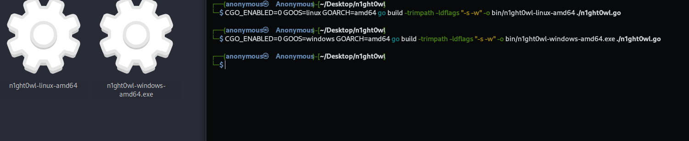


## Usage for Nightowl

PS: Running this tool requires administrator privileges!!!

`$ sudo ./n1ght0wl`


Use the `Up` and `Down` arrow keys to select a network interface, then choose the traced routing table.

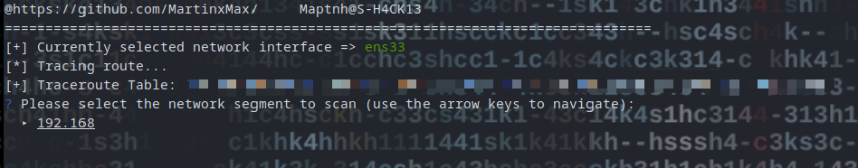


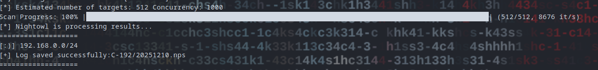


`$ cat C-192/20251210.nps`

You can use the probed network segments for further enumeration with nmap or other tools...

`$ nmap -sn -iL C-192/20251210.nps`


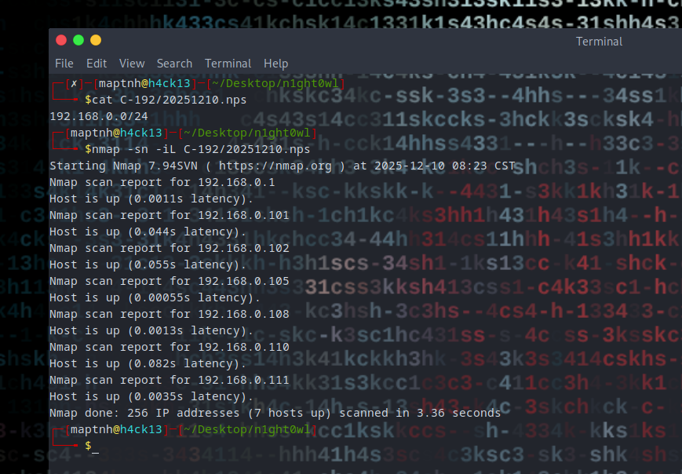


# Raven


**Raven** is an nmap-based scanning and result-management engine.
It works seamlessly with the active subnets discovered by Nightowl, enabling deeper enumeration while maintaining clean, reusable scan outputs.

Raven emphasizes **repeatability control**, **port-focused intelligence**, and **portable result sharing**.

```
[+] Duplicate-scan prevention to avoid redundant or risky rescans
[+] Single-port scan aggregation for rapid service exposure analysis
[+] Lightweight IP management for fast dictionary-style analysis
[+] Cross-device portability: scan once, archive the project, and share with teammates
    without requiring any secondary scans
```


--- 

## Build for Raven


For Linux:
```
$ CGO_ENABLED=0 GOOS=linux GOARCH=amd64 go build -trimpath -ldflags "-s -w" -o bin/r4ven-linux-amd64 ./r4ven.go
```


## Usage for Raven


`$ sudo ./r4ven-linux-amd64`


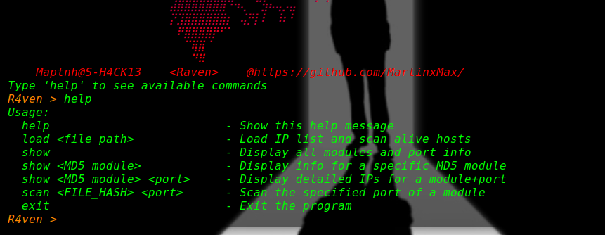


Scanning domain-internal servers on port 8080 using NPS files generated by Nightowl.

`$ sudo ./n1ght0wl-linux-amd64`

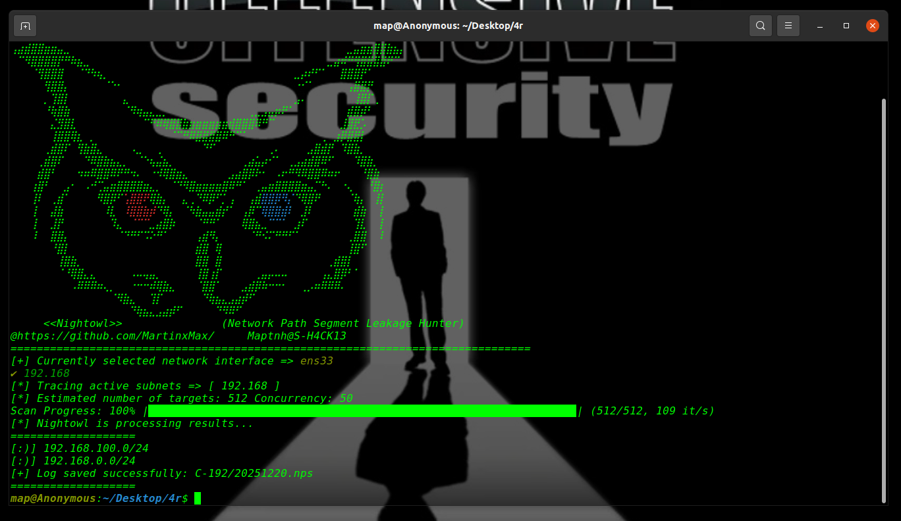

`R4ven > load C-192/20251220.nps`

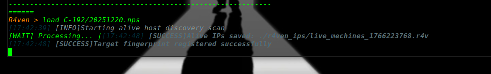

`R4ven > show`

 

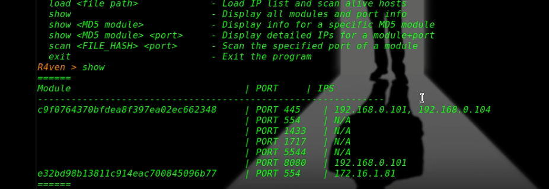

`R4ven > scan c9f0764370bfdea8f397ea02ec662348 8080`

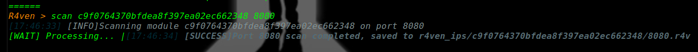

`R4ven > show c9f0764370bfdea8f397ea02ec662348 8080`

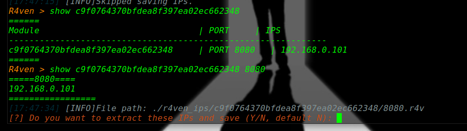

Hint: If you want to perform other actions, enter `y` to extract the IPs.

>[?] Do you want to extract these IPs and save (Y/N, default N): y


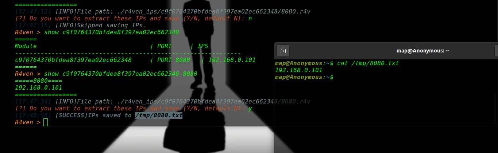


# MS17-010 Scan

`R4ven > scan c9f0764370bfdea8f397ea02ec662348 445`

`$ ./ms17-010_scanner.sh --ips /tmp/445.txt`

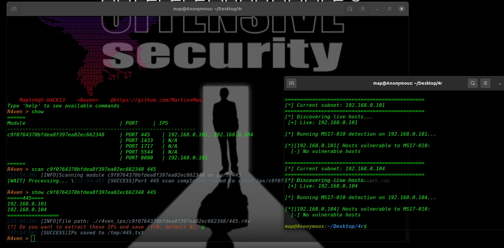


## Blood-Cat

`R4ven > scan c9f0764370bfdea8f397ea02ec662348 554`
 
https://github.com/MartinxMax/BloodCat


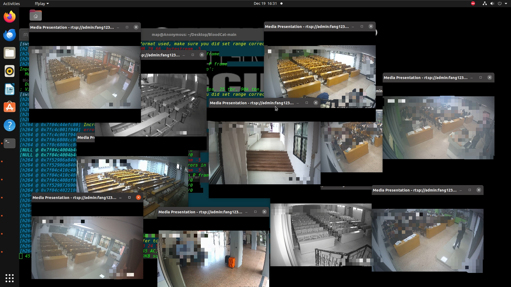

